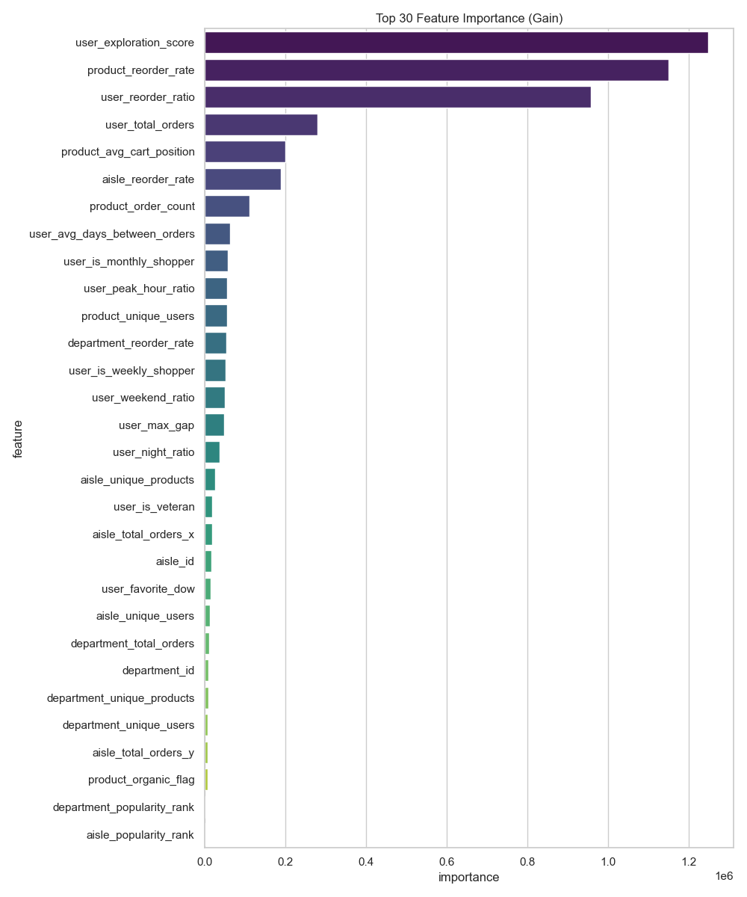
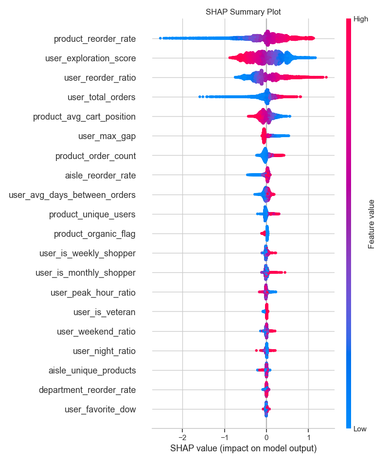

# Instacart – Next Product Reorder Prediction  
Zero2End ML Bootcamp Final Projesi


---

## 1. Proje Özeti  
Bu proje, Instacart kullanıcılarının geçmiş sipariş davranışlarına bakarak bir ürünün bir sonraki siparişte tekrar alınıp alınmayacağını tahmin edebilen uçtan uca bir makine öğrenimi çalışmasıdır.

Tekrar satın alma tahmini; ürün öneri sistemleri, kampanya yönetimi, stok optimizasyonu ve müşteri sadakati gibi e-ticaret süreçlerinde önemli bir iş değeri sağlar.

Detaylı teknik dokümantasyon:  

**`docs/final_report.md`**

---

## 2. Veri Seti 
 
Kullanılan veri seti: **Instacart Market Basket Analysis**  
Kaynak: https://www.kaggle.com/datasets/psparks/instacart-market-basket-analysis/data

**Özet:**  
- 3.4M sipariş  
- 32M ürün hareketi  
- 200K kullanıcı  
- 134K ürün  

---

## 3. Keşifsel Analizden Öne Çıkan Bulgular  

EDA sonuçlarından öne çıkan davranış örüntüleri:

- Sipariş yoğunluğu 10:00–16:00 saatlerinde artmaktadır.  
- En yüksek aktivite Pazar ve Pazartesi günlerindedir.  
- Kullanıcıların sipariş aralıkları çoğunlukla 3–10 gündür.  
- `reordered` oranı yaklaşık %60 seviyesindedir.

Bu bulgular, Feature Engineering aşamasının temelini oluşturmuştur.

---

## 4. Özellik Mühendisliği  

Toplam **37 Feature** üretilmiştir.

Üretilen özellikler:

- Kullanıcı alışveriş ritimleri  
- Zamanlama alışkanlıkları  
- Ürün popülerliği  
- Kullanıcı–ürün geçmiş ilişkisi  
- Aisle / departman yoğunlukları  
- Sepet içi davranışlar  
- Keşif eğilimi  

Bu özellikler model performansını belirgin şekilde yükseltmiştir.

---

## 5. Model Geliştirme

Model geliştirme sürecinde amaç; kullanıcı–ürün etkileşimlerinin karmaşıklığını öğrenebilen, yüksek genel performans sağlayan ve büyük veri hacmi üzerinde verimli çalışan bir algoritma seçmekti.

### Baseline Model

İlk adım olarak sadece `reorder_ratio` kullanılarak Logistic Regression modeli kurulmuş ve F1 skoru **0.7452** olarak elde edilmiştir.  .

### Benchmark Sonuçları
Üç farklı model varsayılan ayarlarla denenmiştir:

- Logistic Regression - 0.7446  
- XGBoost - 0.7658  
- LightGBM - **0.7663**

LightGBM;

- tabular veri üzerinde daha yüksek başarı,  
- büyük veri setlerinde hız,  
- düşük bellek kullanımı,  
- kategori benzeri davranış gösteren sinyalleri iyi öğrenebilmesi  

gibi nedenlerden **final model** olarak seçilmiştir.

### Validasyon Stratejisi

Veride aynı kullanıcının hem eğitim hem test setine düşmesi **data leakage** yaratacağı için klasik KFold yerine **User-based GroupKFold** kullanılmıştır. Bu sayede modelin, hiç görmediği kullanıcılar için ne kadar genelleme yapabildiği ölçülmüştür.

### Hiperparametre Optimizasyonu

Model performansını artırmak adına **Optuna** kullanılmış ve 30 deneme sonunda:

- düşük öğrenme oranı,  
- sınıf dengesizliği için uygun class_weight

ile optimum yapı elde edilmiştir.

Optuna sonrası LightGBM’in F1 skoru **0.7779** seviyesine ulaşmıştır.

### Data Leakage Önlemleri

Model eğitiminden önce sızıntı keşfedilmiş: hedef değişkenle doğrudan ilişkili olan veya geleceği referans alan tüm özellikler temizlenmiştir.  Bu sayede modelin performansı yapay olarak artmamış, gerçekçi bir metrik elde edilmiştir.

Detaylı teknik dokümantasyon:  

**`docs/training_report.md`**

---

## 6. Final Performans  

Karar eşiği: **0.40**

**Sonuçlar:** 

- **F1 Score:** 0.7779  
- **Recall:** 0.91  
- **Precision:** 0.69  

### Confusion Matrix  


---

## 7. Model Açıklaması  

### Feature Importance  


### SHAP Summary Plot  


---

## 8. İş Akışı (Business Flow)

```
Kullanıcı Siparişi
        ↓
Geçmiş Sipariş Kayıtları
        ↓
Özellik Üretimi (Davranış, Popülerlik, Etkileşim)
        ↓
Eğitilmiş Model (LightGBM)
        ↓
Tekrar Satın Alma Tahmini (0–1)
        ↓
Öneri Sistemi / Sepet Tahmini
        ↓
Kullanıcı Arayüzü (Streamlit)
        ↓
Geri Bildirim → Güncellenmiş Veri
        ↓
Periyodik Yeniden Eğitim
```

---

## 9. Teknik Pipeline

```
Data Loading
      ↓
EDA (Dağılımlar, Zaman, Kategoriler)
      ↓
Feature Engineering (User, Product, Interaction)
      ↓
Baseline Model
      ↓
Model Training (LightGBM + Optuna + GroupKFold)
      ↓
Evaluation (F1, Recall, SHAP)
      ↓
Deployment (Streamlit + Docker + HF Spaces)
      ↓
Monitoring (SQLite Logging + Streamlit Dashboard, Opsiyonel)
```

---

## 10. Deployment 

Model Docker tabanlı bir yapı ile paketlenmiş, Streamlit arayüzü üzerinden çalıştırılabilir hale getirilmiştir.  
CI/CD süreci GitHub Actions ile otomatik olarak yönetilmektedir.

**Canlı Demo:**  

https://huggingface.co/spaces/4F71/instacart-reorder-prediction

### Monitoring 

Modelin ürettiği tahminler lokal bir SQLite veritabanına kaydedilebilir ve Streamlit tabanlı bir dashboard üzerinden izlenebilir. Dashboard, toplam tahmin sayısı, pozitif oran ve olasılık dağılımı gibi temel metrikleri gösterir.

Dashboard’u başlatmak için:

```
streamlit run monitoring/dashboard.py
```

**Dashboard Genel Görünüm ve Detayları**


---

## 11. Kurulum ve Çalıştırma  

### Docker ile 

```
docker build -t instacart-app .
docker run -p 7860:7860 instacart-app
```

### Manuel Kurulum

```
git clone https://github.com/4F71/instacart-next-product-recommendation.git

cd instacart-next-product-recommendation

python -m venv .venv
source .venv/bin/activate   # Windows: .venv\Scripts\activate
pip install -r requirements.txt

streamlit run src/app_streamlit.py
```

---

## 12. Proje Dizini

```
proje/
├── notebooks/                         
|   |                     
│   ├── 01_eda.ipynb                  
│   ├── 02_baseline.ipynb              
│   ├── 03_Feature_Engineering.ipynb   
│   ├── 04_Model_Training.ipynb        
│   └── 05_Model_Evaluation.ipynb      

├── docs/                              
|   |
│   ├── problem_definition.md          # Problem tanımı ve iş bağlamı
│   ├── eda_report.md                  # EDA değerlendirmesi
│   ├── feature_engineering_report.md  # FE stratejisi
│   ├── baseline_report.md             # Baseline sonuçları
│   ├── training_report.md             # Eğitim detayları
│   ├── evaluation_report.md           # Model değerlendirmesi
│   ├── deployment_report.md           # Deployment süreci
│   └── final_report.md                # Uçtan uca özet teknik final raporu
│   └── model_card.md                  # model bilgileri

├── src/                               
|   |
│   ├── inference.py                   
│   ├── app_streamlit.py               
│   ├── service_api.py                 
│   ├── config.py                      
│   └── __init__.py                    

├── models/                            
|   |
│   ├── lgb_model_final.pkl            
│   ├── feature_names.json             
│   └── best_threshold.txt             

├── figures/                           
|   |
│   ├── confusion_matrix_final.png         
│   ├── feature_importance_final.png       
│   ├── shap_summary_plot.png              
│   ├── aisles_top20.png                  
│   ├── departments_top20.png              
│   ├── products_top20.png                 
│   ├── orders_temporal_distribution.png   
│   ├── orders_days_since_prior.png        
│   └── train_reordered_distribution.png    
│   └── baseline_confusion_matrix.png
│   └── cart_order_distribution.png
│   └── threshold_optimization.png
│   

├── run_app.sh                         
│
├── Dockerfile                         
├── requirements.txt                   
└── README.md                         
```

---

## 13. Sonuç  

Bu çalışma; veri keşfinden özellik mühendisliğine, model doğrulamasından dağıtıma kadar uçtan uca bir makine öğrenimi sürecimin tamamını içermektedir. LightGBM tabanlı final model, kullanıcı davranışlarını dikkate alarak tekrar satın alma tahmininde güçlü bir performans sunmuştur.

Proje sırasında veri sızıntısı yönetimi, validasyon stratejileri, açıklanabilirlik (SHAP), Docker tabanlı dağıtım ve CI/CD gibi gerçek dünya MLOps adımlarını uygulama fırsatı oluşmuştur.

Zero2End Bootcamp’in kapsamlı içeriği, mentorluk desteği ve proje merkezli yaklaşımı; bu çalışmayı yalnızca teknik bir model geliştirme sürecinin ötesine taşıyarak gerçek dünya odaklı bir mühendislik deneyimine dönüştürdü. Bu sürece katkı sunan tüm eğitmenlere ve ekibe teşekkür ederim.

---

